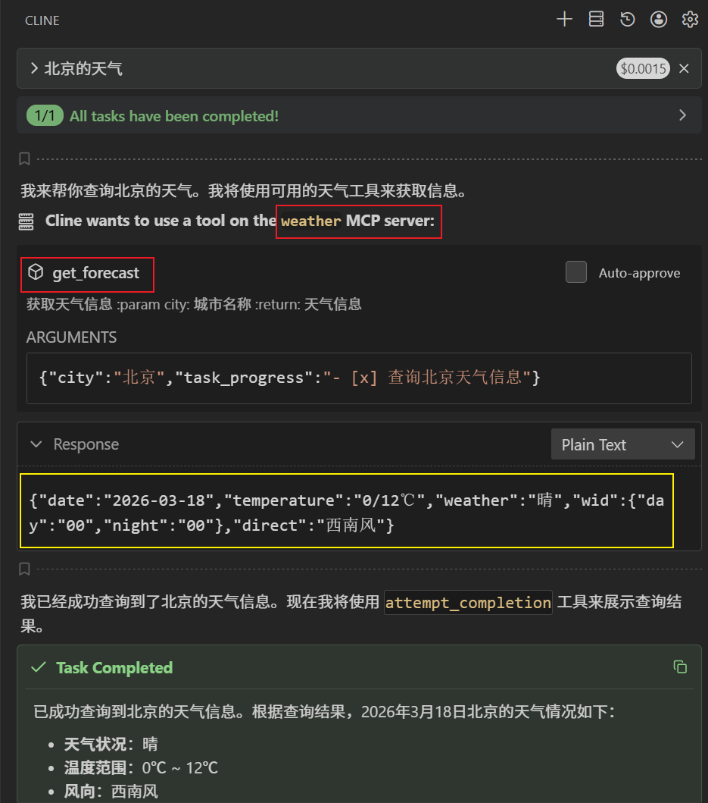

## 是什么

Python语言，基于 mcp 库实现的一个 MCP-Server。

## 有什么能力

预测明天的天气。

## 怎么用

### MCP使用
添加如下 mcpServers 配置
以 VSCode + Cline插件 为例

```json
{
  "mcpServers": {
    "weather": {
      "autoApprove": [],
      "disabled": false,
      "timeout": 60,
      "type": "stdio",
      "command": "uvx",
      "args": [
        "darcycui-mcp"
      ]
    }
  }
}

```
### 本地使用
1. clone项目到本地 path
2. 添加如下配置
```json
{
  "mcpServers": {
    "weather": {
      "autoApprove": [],
      "disabled": true,
      "timeout": 60,
      "type": "stdio",
      "command": "uv",
      "args": [
        "--directory",
        "path\\src\\darcycui_mcp",
        "run",
        "weather.py"
      ]
    }
  }
}

```


## 运行结果


## 参考文章

[马克的技术工坊Github](https://github.com/MarkTechStation/VideoCode/)

[MCP终极指南 - 从原理到实战，带你深入掌握MCP（基础篇）-哔哩哔哩](https://b23.tv/JBOXcym)

[MCP终极指南 - 带你深入掌握MCP（进阶篇）-哔哩哔哩](https://b23.tv/JWfRFIV)

[一文搞懂MCP、Function Calling和A2A](https://mp.weixin.qq.com/s/dAT6l3myGKT3_hX12sMyXw)
